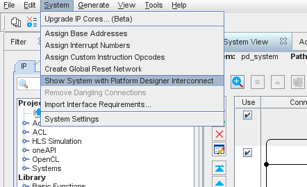
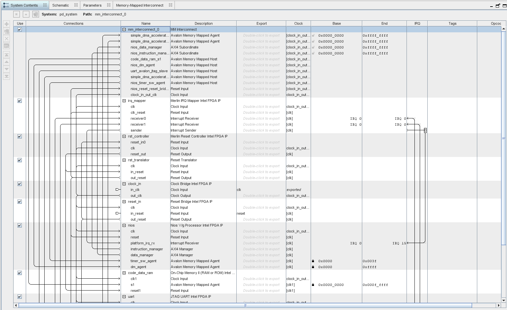
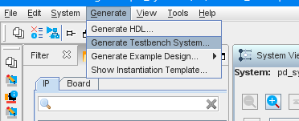

# `NIOSV` Sample
The `NIOS V` sample is a reference design that demonstrates how to simulate an FPGA IP produced with the Intel® oneAPI DPC++/C++ Compiler with a NIOS V embedded soft CPU.

| Area                      | Description
---                         |---
| What you will learn       | How to configure a NIOSV system to interact with an FPGA IP produced with the Intel® oneAPI DPC++/C++ Compiler 
| Time to complete          | ~30 minutes

## Purpose
This FPGA reference design demonstrates a simple Direct Memory Access (DMA) module that is implemented in SYCL*, and how to use a NIOSV soft CPU to interact with it.

## Prerequisites

This sample is part of the FPGA code samples.
It is categorized as a Tier 4 sample that demonstrates a reference design.

```mermaid
flowchart LR
   tier1("Tier 1: Get Started")
   tier2("Tier 2: Explore the Fundamentals")
   tier3("Tier 3: Explore the Advanced Techniques")
   tier4("Tier 4: Explore the Reference Designs")

   tier1 --> tier2 --> tier3 --> tier4

   style tier1 fill:#0071c1,stroke:#0071c1,stroke-width:1px,color:#fff
   style tier2 fill:#0071c1,stroke:#0071c1,stroke-width:1px,color:#fff
   style tier3 fill:#0071c1,stroke:#0071c1,stroke-width:1px,color:#fff
   style tier4 fill:#f96,stroke:#333,stroke-width:1px,color:#fff
```

Find more information about how to navigate this part of the code samples in the [FPGA top-level README.md](/DirectProgramming/C++SYCL_FPGA/README.md).
You can also find more information about [troubleshooting build errors](/DirectProgramming/C++SYCL_FPGA/README.md#troubleshooting), [running the sample on the Intel® DevCloud](/DirectProgramming/C++SYCL_FPGA/README.md#build-and-run-the-samples-on-intel-devcloud-optional), [using Visual Studio Code with the code samples](/DirectProgramming/C++SYCL_FPGA/README.md#use-visual-studio-code-vs-code-optional), [links to selected documentation](/DirectProgramming/C++SYCL_FPGA/README.md#documentation), etc.

| Optimized for                     | Description
|:---                               |:---
| OS                                | Ubuntu* 18.04/20.04 <br> RHEL*/CentOS* 8 <br> SUSE* 15 <br> Windows* 10
| Hardware                          | Intel® Agilex® 7, Arria® 10, and Stratix® 10 FPGAs
| Software                          | Intel® oneAPI DPC++/C++ Compiler<br> Intel® Quartus® Prime Pro Edition Version 23.1 or later TODO: which version of std?

> **Note**: Even though the Intel DPC++/C++ OneAPI compiler is enough to compile for emulation, generating reports and generating RTL, there are extra software requirements for the simulation flow and FPGA compiles.
>
> To use the simulator flow, Intel® Quartus® Prime Pro Edition and one of the following simulators must be installed and accessible through your PATH:
> - Questa*-Intel® FPGA Edition
> - Questa*-Intel® FPGA Starter Edition
> - Questa* Advanced Simulator
> - ModelSim® SE
>
> This design depends on the NIOS V design suite, which is available with Intel® Quartus® Prime Pro Edition 23.1 and later.
>
> Before attempting to use this design, you should ensure the following directories are in your `PATH` environment variable:
>
> ```
> <QUARTUS_INSTALL_DIR>/qsys/bin
> <QUARTUS_INSTALL_DIR>/questa_fe/bin
> ```
>
> :warning: Make sure you add the device files associated with the FPGA that you are targeting to your Intel® Quartus® Prime installation.

## Overview of NIOS V Design

The design has the following directory structure:

| Directory          | Description
|--------------------|------------
|`/custom_ip        `| Directory to hold custom IP (place custom IP cores here)
|`/ip               `| .ip files for all IP inside platform designer system
|`/kernels          `| Directory containing oneAPI kernels (oneAPI kernel sources should be placed here)
|`/pd_system        `| (generated directory) RTL comprising the Platform Designer system 
|`/pd_system_tb     `| (generated directory) Platform Designer test bench system that instantiates pd_system.qsys and wraps it with BFMs
|`/simulation_files `| Scripts to automate co-simulating hardware and NIOS V software
|`/software         `| Nios V sample software with build script (application and BSP will generated from build script)
|`build_and_sim_testsystem.tcl`| Script to run the steps in the [build steps](#build-the-niosv-reference-design) below
|`components.ipx    `| IP search path file that extends the search path to the /custom_ip and /kernels directories
|`pd_system.qsys    `| Platform Designer system (including Nios V, JTAG UART, 1MB of on-chip RAM)
|`test_system.qpf   `| Quartus project file
|`test_system.qsf   `| Quartus settings file

### Hardware Overview

The NIOS V soft CPU is connected to the various other IPs in this design using Platform Designer. This design is stored in the file `pd_system.qsys`.


Note that although FPGA IP produced with the Intel® oneAPI DPC++/C++ Compiler does not support AXI4 interfaces, Platform Designer is able to generate a bridge for you. Click `System` -> `Show System with Platform Designer Interconnect` to see how the Platform Designer interconnect adapts your component's Avalon memory-mapped interfaces to AXI4 interfaces.






### NIOS V Software Overview

The software directory for the Nios V/g core has the following structure:

| Directory                | Description
|--------------------------|------------
|`/software               `| Top level of the software directory
|`---/simple_dma_test     `| Test software that interacts with the DMA kernel in a cosimulation environment
|`------/app              `| (generated directory) Application directory where the Nios V executible (.elf) and memory initialization (.hex) files will be generated
|`------/bsp              `| (generated directory) BSP directory where all the Nios V drivers, library, and HAL files will be generated (do not touch the contents here)
|`------/src              `| Source directory for simple_dma_test
|`------software_build.tcl`| Build script that creates the /app and /bsp directories and populates them.  Edit the top of this file to port it to other projects.

The NIOS V CPU uses memory caching, so make sure you remember to flush the cache **before** you start the `simple_dma_accelerator`. This will guarantee that all the data you wrote to `code_data_ram` will be visible to the `simple_dma_accelerator` IP.

See the comments in the [source code](software/simple_dma_test/src/simple_dma_test.c) for further hints and notes.

### Synthesis Notes

This design does not have any timing constraints or pin assignments, so do not synthesize the design without including those first. This design contains a JTAG UART, so if it is ported to a board ensure the JTAG I/O are constrained properly. The input reset path can be safely cut since the reset block inside the Platform Designer system will synchronize the reset for you.

## Build the `NIOSV` Reference Design

> **Note**: When working with the command-line interface (CLI), you should configure the oneAPI toolkits using environment variables.
> Set up your CLI environment by sourcing the `setvars` script located in the root of your oneAPI installation every time you open a new terminal window.
> This practice ensures that your compiler, libraries, and tools are ready for development.
>
> Linux*:
> - For system wide installations: `. /opt/intel/oneapi/setvars.sh`
> - For private installations: ` . ~/intel/oneapi/setvars.sh`
> - For non-POSIX shells, like csh, use the following command: `bash -c 'source <install-dir>/setvars.sh ; exec csh'`
>
> Windows*:
> - `C:\Program Files(x86)\Intel\oneAPI\setvars.bat`
> - Windows PowerShell*, use the following command: `cmd.exe "/K" '"C:\Program Files (x86)\Intel\oneAPI\setvars.bat" && powershell'`
>
> For more information on configuring environment variables, see [Use the setvars Script with Linux* or macOS*](https://www.intel.com/content/www/us/en/develop/documentation/oneapi-programming-guide/top/oneapi-development-environment-setup/use-the-setvars-script-with-linux-or-macos.html) or [Use the setvars Script with Windows*](https://www.intel.com/content/www/us/en/develop/documentation/oneapi-programming-guide/top/oneapi-development-environment-setup/use-the-setvars-script-with-windows.html).

### On Linux*

1. Enable the NIOS V build tools:

```bash
$> ./<QUARTUS_INSTALL_DIR>/niosv/bin/niosv-shell
```

You can manually follow the steps below, or run the `build_and_sim_testsystem.tcl` script:

```bash
$> quartus_sh -t build_and_sim_testsystem.tcl
```

2. Change to the sample directory (`kernels/simple_dma`)

3. Configure the build system for the Intel® Arria® 10 device family, which is the default.

   ```
   mkdir build
   cd build
   cmake ..
   ```

   > **Note**: You can change the default target by using the command:
   >  ```
   >  cmake .. -DFPGA_DEVICE=<FPGA device family or FPGA part number>
   >  ```

4. Compile the DMA IP. Generate an IP component and optimization report:

      ```
      cmake --build . --target report
      ```

   You can emulate and simulate this design as well, but that is not necessary for this procedure. 

   Continue to Step 5 below.

### On Windows*

1. Enable the NIOS V build tools:

```bash
$> <QUARTUS_INSTALL_DIR>\niosv\bin\niosv-shell.exe
```

You can manually follow the steps below, or run the `build_and_sim_testsystem.tcl` script:

```bash
> quartus_sh.exe -t build_and_sim_testsystem.tcl
```

2. Change to the sample directory (`kernels/simple_dma`)

3. Configure the build system for the Intel® Arria® 10 device family, which is the default.

   ```
   mkdir build
   cd build
   cmake .. -G "NMake Makefiles"
   ```

   > **Note**: You can change the default target by using the command:
   >  ```
   >  cmake .. -G "NMake Makefiles" -DFPGA_DEVICE=<FPGA device family or FPGA part number>
   >  ```

4. Compile the DMA IP. Generate an IP component and optimization report:

      ```
      cmake --build . --target report
      ```

   You can emulate and simulate this design as well, but that is not necessary for this procedure. 
   
   Continue to Step 5 below.

### On both Linux* and Windows*

5. Add the DMA IP to the Platform Designer system. The included `components.ipx` file shows Platform Designer where to look for FPGA IPs produced with the Intel® oneAPI DPC++/C++ Compiler. See the [Platform Designer tutorial](/../../Tutorials/Tools//experimental/platform_designer) for detailed instructions on how to add an FPGA IP to a Platform Designer system. Here are some specific directions for this example:
    1. Rename the kernel `simple_dma_accelerator` to match names used in the NIOS V software.
    2. Connect the kernel interrupt port to the Nios V interrupt receiver and assign its IRQ number to 1 (or any number besides 0 which is used by the UART)
    3. Connect the Nios V data host port to the kernel's `csr_ring_root_avs` port. Ensure the kernel's base address is assigned betweeen `0x0010_0000` and `0x001F_FFFF`.
    4. Connect the kernel's read and write Avalon memory-mapped host ports to the `code_data_ram` on-chip memory.

    

6. Generate the Platform Designer testbench:
    1. Select the "Generate" toolbar menu option --> select "Generate Testbench System"

    

    2. When the Generate dialog box appears select "Generate" and wait for the testbench system to finish generating
    
    3. Exit Platform Designer

7. Build the NIOS V software (make sure you've enabled the NIOS V build tools as described in Step 1):

    1. Navigate to the /software/simple_dma_test directory
    
    2. Run the software build script:

        ```bash
        quartus_sh -t software_build.tcl
        ```
       This script copies the hex file from software compilation to the testbench simulation directory.The hex file is generated in the software directory tree: `/software/simple_dma_test/app/build/code_data_ram_init.hex`. The testbench simulation directory: (for Questasim) lives at `/pd_system_tb/pd_system_tb/sim/mentor`.

8. Run the simulation:

    1. Navigate to the `/simulation_files` directory

    2. Run the simluation script:

        ```bash
        vsim -c -do test_nios_commandline.tcl
        ```

    3. You can tell if the simulation succeeded by looking for this text in the output transcript:

        ```
        # Initializing memory contents for pd_system_tb.pd_system_inst.code_data_ram.code_data_ram.altera_syncram_component.initialize_mem_contents with code_data_ram_init.ver
        #               990000: INFO: pd_system_tb.pd_system_inst_reset_bfm.pd_system_inst_reset_bfm.reset_deassert: Reset deasserted
        # Test design for the simple DMA kernel
        # 
        # Test will initialize 256 incrementing four byte unsigned integers, have the accelerator DMA copy the data to a destination and then check the destination for correctness.
        # Test Pass:  All the data at the destination matches the source.
        # Software will now exit.
        ```

>**Note**: If you encounter any issues with long paths when compiling under Windows*, you may have to create your ‘build’ directory in a shorter path, for example `C:\samples\build`. You can then run cmake from that directory, and provide cmake with the full path to your sample directory.

## License

Code samples are licensed under the MIT license. See [License.txt](https://github.com/oneapi-src/oneAPI-samples/blob/master/License.txt) for details.

Third-party program Licenses can be found here: [third-party-programs.txt](https://github.com/oneapi-src/oneAPI-samples/blob/master/third-party-programs.txt).
